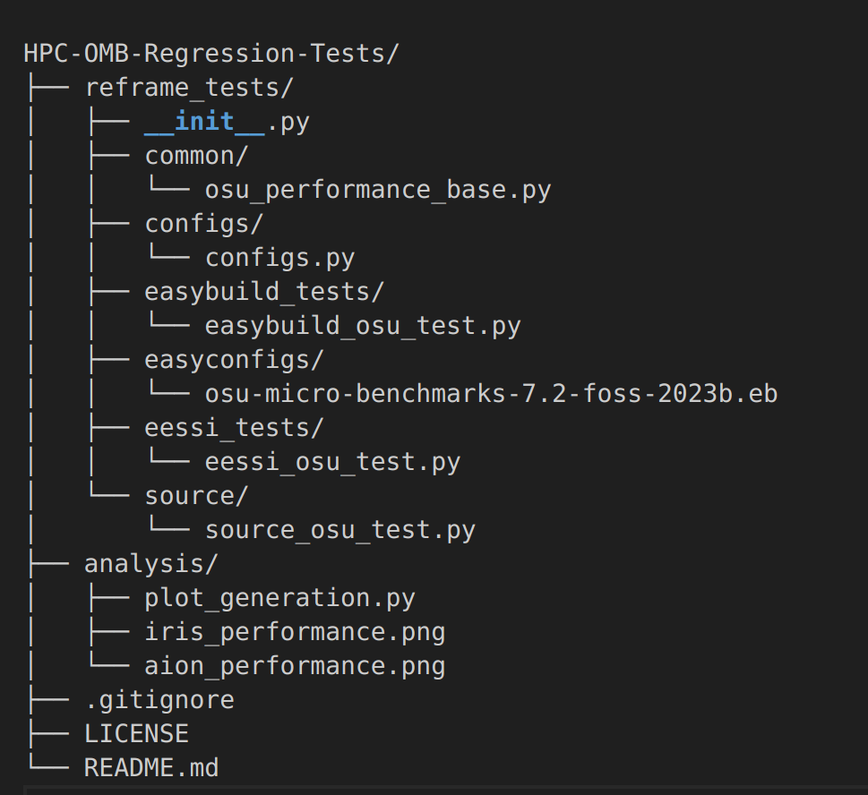
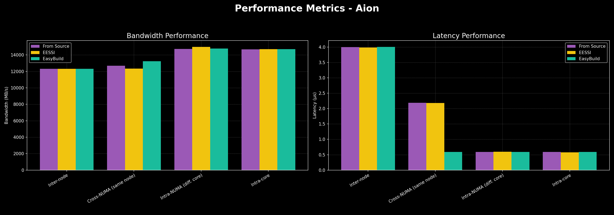
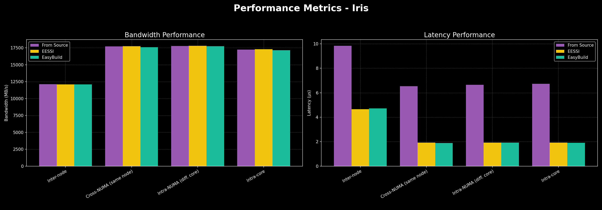

# 🔬 HPC Regression Testing of MPI Communication with OSU Micro-Benchmarks

This project implements **regression tests using ReFrame** to evaluate **MPI communication performance**—specifically **latency** and **bandwidth**—on **ULHPC clusters (Aion and Iris)**. The benchmarks are based on the **OSU Micro-Benchmarks (OMB) v7.2**, designed to assess communication overheads using **`osu_latency`** and **`osu_bw`** tests.

---

## 📌 Objectives

- ✔️ Measure and monitor **intranode** and **internode** communication performance.
- ✔️ Create **ReFrame regression tests** that run OSU MPI benchmarks using multiple binary sources.
- ✔️ Compare performance across **different system architectures** (NUMA nodes, sockets, nodes).
- ✔️ Track **latency variations** and **bandwidth degradation** over time for **regression detection**.

---

## 🧪 Benchmarks

| Benchmark     | Purpose             | Message Size | Metric       |
|---------------|---------------------|--------------|--------------|
| `osu_latency` | Measures MPI latency | 8192 Bytes   | Microseconds |
| `osu_bw`      | Measures MPI bandwidth | 1 MB        | MB/s         |

> Typical Results on Aion (for comparison):
> - **Intra-node latency**: ~2.3 µs
> - **Inter-node latency**: ~3.9 µs
> - **Bandwidth**: ~12,000 MB/s

---

## 🏗️ System Architecture Cases

To account for architectural differences, tests are run in multiple configurations:

1. Same **NUMA node**
2. Same **socket**, different **NUMA nodes**
3. Same **compute node**, different **sockets**
4. **Different compute nodes**

`hwloc` is used to explore the system topology and configure these placements accurately.

---

## 🔧 Compilation Modes

Each benchmark is tested using **three compilation or sourcing methods**, all integrated into ReFrame:

1. **Generic compilation** from source using `foss/2023b` toolchain (from `env/testing/2023b`)
2. **EasyBuild compilation** using ReFrame’s EasyBuild integration
3. **EESSI binaries** loaded directly from the EESSI software stack

## Program Structure:


## 🚀 Getting Started

### Prerequisites

- ULHPC access (Aion or Iris)  
- Bash shell  
- ReFrame ≥ 4.7.4  

## Clone & Setup
### Access to a ULHPC cluster (aion or iris).
```bash
 ssh iris-cluster

 or 

 ssh aion-cluster
```
### A command-line environment:
```bash
 si
```
### Clone the project repository to your home or workspace directory on the cluster.
```bash
git clone git@github.com:JabinTasnimUrmy/HPC_OMB_Regression_Tests.git
cd HPC-OMB-Regression-Tests
```
### Environment Setup:
```bash
module load devel/ReFrame/4.7.4-GCCcore-13.2.0
```
To run the OSU Micro-Benchmarks using ReFrame, use the following commands for different test suites:

### 🔹 Basic OSU Latency Tests (Aion and Iris)
```bash
reframe -C reframe_tests/configs/configs.py -c reframe_tests/source/osu_build.py -c reframe_tests/source/osu_latency.py --run --performance-report
```

### 🔹 Basic OSU Bandwidth Tests (Aion and Iris)
```bash
reframe -C reframe_tests/configs/configs.py -c reframe_tests/source/osu_build.py -c reframe_tests/source/osu_bandwidth.py --run --performance-report
```

### 🔹 EasyBuild-based OSU Benchmarks (Aion and Iris)
```bash
reframe -C reframe_tests/configs/configs.py -c reframe_tests/easybuild_tests/ --run --performance-report
```

### 🔹 EESSI-based OSU Benchmarks (Aion/Iris)
```bash
reframe -C reframe_tests/configs/configs.py -c reframe_tests/eessi_tests/ --run --performance-report
```
---
# Resources
1. ReFrame Testing Framework: https://reframe-hpc.readthedocs.io 
2. EESSI Software Stack: https://www.eessi.io/docs
3. OSU Micro-Benchmarks: http://mvapich.cse.ohio-state.edu/benchmarks/
4. ULHPC User Guide: https://hpc.uni.lu/users/docs/

---

# Aion Performance Summary



The performance benchmarks on the Aion system demonstrate that there is no significant performance difference between compiling software from source, using EasyBuild, or using binaries from the EESSI software stack.
Bandwidth & Latency: Across all test cases (inter-node, cross-NUMA, and intra-core), all three methods delivered nearly identical results.
Key Takeaway: This validates that the convenience and reproducibility offered by EESSI and EasyBuild do not come at the cost of performance on this architecture. Users can confidently leverage these tools without concern for performance degradation.

---

# Iris Performance Summary



The benchmarks on the Iris system reveal a critical performance advantage when using managed software environments.
Latency: The EESSI and EasyBuild installations delivered dramatically lower latency (2-3x faster) compared to the manual From Source build. This points to a significant optimization issue in the manual compilation for the Iris architecture.
Bandwidth: Bandwidth performance was nearly identical across all three methods, indicating the issue was specific to latency optimization.
Key Takeaway: Using EESSI and EasyBuild is strongly recommended on Iris, as their curated build recipes prevent severe performance regressions and ensure that the software is properly optimized for the hardware.

